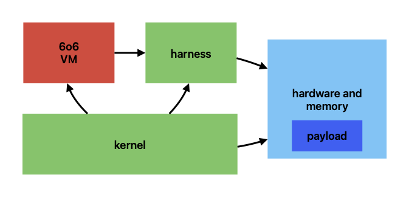

# 6o6: A Virtualized 6502 on a 6502

[Another Old Vintage Computing Research Advance for Humanity!](https://oldvcr.blogspot.com/2024/04/virtualizing-6502-with-6o6-and.html)

Copyright 2002-2024 Cameron Kaiser.  
All rights reserved.  
Distributed under the Floodgap Free Software License.

## A real software NMOS 6502 that runs on a 6502

6o6 is a component that runs 6502 code on a 6502 CPU in a virtual machine, with full control of guest execution and completely abstracted memory access. It achieves higher performance than simple emulation by reusing the host CPU's ALU for certain operations, like virtualization would on modern CPUs, as well as primitive instruction fusion and using features of the assembler to inline memory accesses within it. It's even capable of virtualizing itself and has a rigourous test suite. Four demonstration applications are included.

## Features

* Runs on NMOS and CMOS 6502s (and the 65816 in 8-bit mode)
* Modular software architecture
* Full NMOS 6502 instruction set support (sorry, no undocumented opcodes on purpose)
* Passes [well known functional tests](https://github.com/Klaus2m5/6502_65C02_functional_tests)
* Can virtualize itself
* Uses host ALU for speed
* Traps illegal instructions
* Traps user-defined interrupt instruction (opcode $42) for features such as breakpoints and hypercalls
* Provides library routines for IRQs and `RTS` to implement emulated interrupts and trappable routines
* Optional inline memory access
* Optional instruction fusion support ("extra helpings")

## How it works



A virtualized environment using 6o6 has several distinct pieces: the _hardware_, containing the guest _payload_ to be run; the _harness_, which turns a virtual address into a physical one, controls reading and writing of memory, and controls the processor stack; and the _kernel_, which is your application's supervisor-level code that calls 6o6 to execute the payload and handles all other tasks.

The harness and kernel are your code and run directly on the host. You are responsible for setting up your environment and connected devices. When execution is ready to commence, your kernel (or main program, as appropriate) then calls the 6o6 _virtual machine_ (VM), which calls the harness to fetch the next instruction or group of instructions from the payload, and calls the harness again for any memory loads or stores when the instruction or group is retired. The VM can also run certain guest instructions directly on the host's ALU for faster and fully precise results and flags, instead of performing the operations manually.

After the instruction or instruction group is completed, the VM then returns to your kernel. Your kernel then should handle any exceptions the VM returns, inspect or manipulate the processor state, and do other housekeeping. If your application requires them, your kernel is also responsible for manually injecting any simulated IRQs or NMIs; other than the `BRK` instruction, 6o6 does not handle any interrupts at all (see also _Interrupt flag options_). The remainder of the payload is executed by calling back to the VM in a loop, servicing any new requests each time. The kernel can also decide what to do when the payload's execution terminates.

## General system requirements

6o6 runs on any NMOS or CMOS 6502 with sufficient RAM and at least 11 free bytes of zero page space, four of which must be two-byte pairs for address storage. However, because it uses self-modifying code for speed, it is currently not possible to run it directly from an EPROM or other read-only memory, though it may be copied from one into RAM on startup (it should compress easily as much of the code is unrolled).

6o6 is cross-assembled from assembly source into a 6502-compatible binary using the portable [`xa65`](http://www.floodgap.com/retrotech/xa/) assembler, which is in basic C and compiles on a wide variety of operating systems and architectures. `xa65` (hereafter `xa`, its primary executable) has a C-like preprocessor which 6o6 uses heavily for inlining and macros. As such, other cross-assemblers are not currently supported (see _Issues and pull requests_ for more about this - there's a reason it's the way it is).

The self-test and examples have separate documentation. To run [the self-test](test/), you must have a working C compiler, `xa` and `make`. To build [the examples](examples/), you must have `xa` and `make` (building the Apple II disk images additionally requires [Apple Commander](https://applecommander.github.io/), preferably placed in the same directory named `ac.jar` unless you change the path in the `Makefile`), or you can download pre-built example binaries from the Releases tab.

It is strongly recommended you verify correct operation **before using 6o6** by **running the self-test**. To do so, enter the `test` directory and type `make`. This test is fairly exhaustive and may take up to several minutes on slow machines. If the self-test runs successfully, 6o6 has been validated on your system and is likely to function correctly. If it does not, or you need more information, refer to [the self-test documentation](test/).

## Examples

The remainder of this document is intended as a reference guide. It may be instructive to look at the provided examples before you read it, and/or use them as templates for your own programs. The first three will run on an unexpanded Commodore 64 or Commodore 128 in 64 mode, or an Apple IIe, IIc or IIgs with at least 64K of RAM. The fourth requires a Commodore 64 (or Commodore 128 in 64 mode) with a geoRAM-compatible RAM expansion of at least 64K.

Pre-built binaries of the examples may also be downloaded from the Releases tab. The C64 binaries are naked `.prg` files starting at 2049 ($0801) that you `LOAD` and `RUN`; the Apple II binaries are naked binary files starting at 2051 ($0803) that you `BRUN` or `BLOAD`/`CALL`.

* [`helloworld`](examples/helloworld/). This is a trivial example which runs a payload that prints "hello world" to the screen. It demonstrates a basic harness and kernel, as well as trapping calls by the guest and implementing them natively. 
* [`inception`](examples/inception/). Using the exact same payload, harness and kernel as the "hello world" example, this example virtualizes the payload, then virtualizes itself virtualizing the payload, then virtualizes itself virtualizing itself virtualizing the payload. As each deeper layer completes execution, the termination condition propagates up. This is all accomplished by simply making more copies in memory; the code is not modified or patched each time.
* [`tasks`](examples/tasks/). This example implements a small two-task kernel, one displaying letters and one displaying reverse video numbers, and alternates between them as you press or hold down a key. Although each task uses the same zero page location to keep track of the current digit or letter, they are independent of each other, and each task resumes at the same place it left off. On the C64, because the task may swap after sending the reverse-on character but before printing the number, either task may appear in reverse video (the Apple II has separate character codes for reverse video). 
* [`vmgr`](examples/vmgr/). This example requires a C64 with a geoRAM or compatible clone of 64K or larger. It emulates a basic 64K 6502 system with a serial terminal console, completely running the entirety of the guest addressing space within the geoRAM. It includes a pre-built ROM image containing both a simple monitor-debugger and Lee Davison's EhBASIC from [the RC2014-6502 project](https://github.com/ancientcomputing/rc2014/tree/master/rom/6502/monitor_ehbasic). This ROM is unmodified and copied into the geoRAM on startup.

See each individual example for build instructions and a brief explanation of their functional parts.

## Building the VM

To build the VM you must provide certain labels and preprocessor defines to `xa`, or it may not assemble. It is recommended that you put your configuration into a separate file and provide that to 6o6, either by passing the `-DCONFIGFILE=filename` option on the `xa` command line, or passing the options individually on the `xa` command line, or manually changing 6o6.

Once you have identified and set up the necessary configuration, typically a command line such as `xa -o 6o6.o 6o6.asm` followed by any command line defines is sufficient to assemble the binary. The `Makefile`s in the examples demonstrate a typical cross-build process. See the [`xa` manual page](http://www.floodgap.com/retrotech/xa/xa.1.html) for all available options. If you get an error assembling 6o6, make sure you have fully specified all necessary labels.

### Zero page labels

A set of necessary zero page labels must be defined, typically in your configuration file. Here is what the demonstration applications use for building on the Commodore 64.


```
        ; simulated register locations in zero page
        ; these must be preserved between calls to the vm
areg    = $8b
xreg    = $8c
yreg    = $8d
preg    = $fb
sptr    = $fc
pc      = $fd   ; and $fe

        ; extra helpings mode
ehmode  = $a6

        ; work area for memory access
dptr    = $8e   ; and $8f

        ; work area for instruction dispatch
hold0   = $9f
hold1   = $a5   ; need not be configuous
abandon = $9e   ; save stack pointer if we abandon ship (protection fault?)

        ; reserved work areas for the harness/kernel (if they want)
        ; these should be contiguous
hhold0  = $be
hhold1  = $bf
```

`areg`, `xreg`, `yreg`, `preg`, `sptr`, and `pc` (two contiguous bytes) are the complete processor state. They contain the accumulator (A), X and Y registers, processor status register (P), stack pointer register (S) and the 16-bit program counter (PC). Unless you intend to deliberately modify them to change the execution address or register contents, they should be preserved between VM calls.

`ehmode` is the flag byte for dynamically controlling "extra helpings" mode (see _Operating mode options_). If you do not enable extra helpings, or enable it always, then this label doesn't need to be defined.

`dptr` (two contiguous bytes) is the active 16-bit virtual address for loads and stores. The harness is expected to consult this pointer to compute the actual physical address but it must not modify it. Your kernel can also use this pointer between VM calls, but it will be overwritten on the next call to the VM.

`hold0` and `hold1` are temporary work areas used by the VM for certain addressing modes and opcodes. They need not be contiguous. Your kernel can also use them between VM calls, but they will be overwritten on the next call to the VM.

`abandon` is the temporary holding byte for the native stack pointer and is used to unwind the stack if your harness returns an exception. If your harness **never** throws exceptions **and** you've declared this by enabling faultless mode (see _Operating mode options_), then this label doesn't need to be defined. Otherwise, your kernel can also use this byte between VM calls, but it will be overwritten on the next call to the VM.

Finally, `hhold0` and `hhold1` are temporary work areas that can also be used as a single 16-byte pointer (therefore two contiguous bytes). They are explicitly defined as available for the use of your harness or kernel, and the examples use them to temporarily store any computed physical addresses. If you don't need to use them, then they don't need to be defined; the VM itself never references them.

### Configuration defines

You then need to specify 6o6's starting address. You can do this with `#define VMSADDR address` where `address` is the starting address in decimal or prepended with `$` for hexadecimal. Most configurations of 6o6 will generate an object ranging from 10 to 16 kilobytes, so you should provide an address with at least this much contiguous RAM available. This value can also be an expression or other label in legal `xa` syntax. You can also pass this value on the `xa` command line with `-DVMSADDR=address` or you can provide it in your configuration file.

You must also tell 6o6 where the harness is located in memory (see _Writing your harness_ for details on the required calling convention), specified either by `#define HARNESS address` where `address` is the starting address (or on the `xa` command line with `-DHARNESS=address`), or providing it in your configuration file.

If you are building 6o6 on a system that does **not** require the starting address as the first two bytes of the file, such as the Apple II family, or you are building 6o6 to link into another binary, disable automatically inserting the starting address with `#define NO_SADDR_IN_FILE 1` (or `-DNO_SADDR_IN_FILE=1` on the command line), or provide it in your configuration file. This is the default for historical reasons since 6o6 was originally developed on Commodore microcomputers.

#### Return codes and exceptions

Next, you must provide the exception return codes for your application (see _Continuing or restarting after an exception_ for how your kernel might use them). These are preprocessor defines that all start with the characters `R_`. At least three are mandatory as they are directly returned by the VM, but you can define any additional exceptions meaningful to your application which may use any unique 8-bit value. The example applications use the following seven:

```
#define R_OK            0       /* all's well */
#define R_BRK           1       /* break has occurred (replaces B flag) */
#define R_MFAULT        2       /* memory fault propagated from harness */
#define R_BADINS        3       /* totally illegal instruction */
#define R_UDI           4       /* user-defined (debug) irq -- check x for
                                        the passed parameter */
#define R_STACKUNDER    5       /* stack underflow, propagated from harness
                                        or dorts */
#define R_STACKOVER     6       /* stack overflow, same */
```

* `R_OK` is returned by the VM after a successful run. Defining it is **required**.
* `R_BRK` is returned by the VM after a `BRK` instruction is executed. The stack will be properly set up for you, but you must manually set the PC to the routine you wish to handle the resulting IRQ. Defining it is **required**.
* `R_MFAULT` may optionally be returned by your harness if a memory protection fault (as you define it) occurs. If you define a complete 64K addressing space and/or ignore illegal accesses, you may not need to trigger this exception, so it is optional.
* `R_BADINS` is returned by the VM if an illegal or undocumented opcode is executed (except for the UDI instruction). Defining it is **required**.
* `R_UDI` is returned by the VM if the special user-defined interrupt "UDI" opcode (opcode $42) is executed. This opcode is intended for features such as breakpoints and hypercalls. The current contents of the guest X and Y registers are loaded into the host X and Y registers, and the VM exits with the guest PC pointing to this instruction. You may choose to simply treat it the same as an illegal instruction, but even if you do, defining it is still **required**. However, if you set `UDI_IS_ILLEGAL` (see _Operating mode options_), then it is automatically treated like any other illegal opcode, and defining this exception becomes optional.
* `R_STACKUNDER` may optionally be returned by your harness if a stack underflow occurs, such as an `RTS` with no return address on the stack. Your harness is not required to trigger an exception for this situation if you choose to simply wrap the stack pointer, and so it is optional.
* `R_STACKOVER` may optionally be returned by your harness if a stack overflow occurs. Your harness is not required to trigger an exception for this situation if you choose to simply wrap the stack pointer, and so it is optional.

#### Operating mode options

The following options control how the VM operates. You do not need to specify any of these options, but the object generated may not be well-optimized.

* **"Extra helpings."** When this mode is not enabled, which is the default, each call to the VM executes exactly one instruction and returns. "Extra helpings" mode implements a simplified form of instruction fusion where immediate instructions, accumulator oriented instructions, most implied instructions (except those that access memory or the processor stack) and branches not taken may be grouped together on a single call to the VM. This reduces the overhead of your kernel and improves throughput. Instructions that access memory apart from instruction fetches, or change the PC to anything other than the next instruction, or trigger an exception, terminate an execution group. Extra helpings mode is usually advantageous for most applications and allows your kernel to still intercept execution at defined locations for things like natively emulated calls. However, instructions that require precise control of the PC or that may execute over a memory boundary into a trappable routine may not function correctly with extra helpings enabled, so it is not the default.
    * `#define HELPINGS 1` in your configuration file (or `-DHELPINGS=1` on the command line) **enables** extra helpings. In this mode, the zero page location `ehmode` (see _Zero page labels_) is consulted after an eligible instruction is executed. If the LSB of the PC is less than the current value of `ehmode`, then the VM goes back for "extra helpings." This allows you to turn this mode on and off dynamically: if `ehmode` is zero, then it can never be smaller than the PC LSB, and no eligible instructions are fused. If it is 255, then it will always be at least as large as the PC LSB, and all eligible instructions are fused. A useful in-between value might be 252, which ensures that an eligible instruction potentially straddling a page boundary will not be fused and those instructions will be single-stepped by the VM. Other values may have other potential uses.
    * If you know that you **always** want extra helpings for eligible instructions, which will be the majority of applications, then `#define HELPINGSALWAYS 1` (or `-DHELPINGSALWAYS=1` on the command line) will eliminate the check. This will generate a faster and smaller VM. In this configuration, the zero page label `ehmode` does not need to be defined.

* **Faultless mode.** If your harness will never generate an exception, then the code needed to unwind the stack can be eliminated with `#define FAULTLESS 1` or `-DFAULTLESS=1` on the command line. This will generate a faster and smaller VM. Note that the VM can still generate its own exceptions, but these don't require the stack to be adjusted. In this configuration, the zero page label `abandon` does not need to be defined.

* **Disable UDIs.** Opcode $42 is defined in 6o6 by default as a "user-defined interrupt" in 6o6 (this is normally a jam instruction on NMOS 6502s, a 2-byte `NOP` on 65C02s and the `WDM` opcode on 65816). Here, interrupt is from the perspective of the VM: when this opcode is encountered, the guest X and Y registers are loaded into the host X and Y registers and the VM exits, leaving the PC pointing to the opcode and returning `R_UDI` in the accumulator (see _Return codes and exceptions_). As this opcode is intended for implementing breakpoints and hypercalls, it's handled slightly differently from other illegal instructions (see _Continuing or restarting after an exception_). If you don't want to implement this, then `#define UDI_IS_ILLEGAL 1` (or `-DUDI_IS_ILLEGAL=1` on the command line), which will make this opcode the same as any other illegal instruction. This will make the VM slightly smaller.

* **Interrupt flag options.** Because the host ALU is used to set flags, the host processor status (P) register will transiently reflect the state of the guest, which may cause the interrupt flag to be set and disable host IRQs for very brief periods. This doesn't affect 6o6 and the intervals are very short, but if your host can't tolerate this, you can change the behaviour of the emulated CPU. Note that these options do not match official 6502 behaviour and they may be observable from the guest.
    * By default, the `BRK` instruction in 6o6 **does not set** the interrupt flag, since your kernel is responsible for any simulated IRQs anyway and doing so is therefore meaningless. However, this causes the self-test to fail, so the self-test explicitly sets `#define ACCURATE_IRQ 1` (or `-DACCURATE_IRQ=1` on the command line). In this mode the I flag is explicitly **set** on `BRK` like a real 6502. If your application requires this behaviour, you can enable it the same way. This option also affects the utility routine for IRQ setup (see _The 6o6 jump table and calling convention_).
    * If you want to turn the `SEI` instruction into an illegal opcode (which you can optionally trap), `#define SEI_IS_ILLEGAL 1` (or `-DSEI_IS_ILLEGAL=1` on the command line). In this mode, the VM will throw an illegal instruction exception when the instruction is executed. Note that if this option is enabled, the self-test will _fail_.
    * If you want to turn the `SEI` instruction into a no-op, `#define SEI_IS_NOP 1` (or `-DSEI_IS_NOP=1` on the command line). Note that if this option is enabled, the self-test will _fail_.

## The 6o6 jump table and calling convention

6o6 defines six entry points, though only three are currently in use. Your kernel (and harness if needed) call(s) them directly.

In the list below, addresses are given relative to 6o6's starting address, as specified in `VMSADDR` in _Building the VM_ (so 0 = 6o6 starting address + 0, 3 = 6o6 starting address + 3, etc.). For purposes of explanation, the list below is in _reverse_ order.

* Run the VM (15). **This is 6o6's primary entry point** and is called by your kernel. The current state of the guest CPU is expected to be in `areg`, `xreg`, `yreg`, `preg`, `sptr` and `pc` (see _Zero page labels_). A, X and Y are clobbered. One (or more) guest instructions are executed; if the run was successful, the VM returns `R_OK` in the accumulator. Any other value is an exception as listed in _Return codes and exceptions_.
* Future expansion (12).
* Future expansion (9).
* Sets up an IRQ (6). This is a utility routine your kernel can call to generate a simulated IRQ or NMI. It places the PC on the guest stack followed by the processor status register (P) and returns control to your kernel. The exact value of the status register is affected by `ACCURATE_IRQ` (see _Operating mode options_). A, X and Y are clobbered. If the operation was successful, 6o6 returns `R_OK` in the accumulator. Any other value is an exception as listed in _Return codes and exceptions_. After the setup completes, your kernel is responsible for adjusting PC to the routine (if any) you want to handle the simulated IRQ or NMI before calling the VM for the next instruction.
* Executes an emulated `RTS` (3). This is a utility routine your kernel can call after simulating a subroutine call your kernel has intercepted (such as by seeing the PC jump to a particular location). It pulls the return address from the stack and sets PC for you, exactly as if an `RTS` instruction had been executed on the guest's behalf, and returns control to your kernel. A, X and Y are clobbered. If the operation was successful, 6o6 returns `R_OK` in the accumulator. Any other value is an exception as listed in _Return codes and exceptions_.
* Bailout (0). Your harness (not kernel) must call this routine, naturally with a `JMP`, to throw an exception so that the stack can be properly unwound (see _Writing your harness_). The exception should be passed in the accumulator using a value listed in _Return codes and exceptions_. The X register is clobbered by this routine. If faultless mode is on, this simply becomes an `RTS` (see _Operating mode options_).

## Writing your kernel

Your kernel need only obey the 6o6 calling convention above and can be written with any assembler, though if you choose to use the same labels and macros, you may find it easier to also use `xa`. You should initialize the guest CPU state before calling the VM for the first time, at minimum setting the PC to the virtual execution start address (like a real 6502 would do from its reset vector).

### Continuing or restarting after an exception

If an exception is passed by the VM in the accumulator (see _Return codes and exceptions_), execution can be continued under certain circumstances.

* An `R_BRK` exception for a `BRK` instruction can always be continued from. A fetch has occurred, so the PC points to the instruction after the `BRK`. Like a real 6502 the return address on stack for `RTI` points three bytes after the `BRK`, i.e., PC+2. Your application should ordinarily treat this as an IRQ and load your desired IRQ handler routine into the PC before calling the VM again, though you are not obliged to.
* An `R_UDI` exception for a user-defined interrupt (opcode $42, either `JAM`, 2-byte undocumented `NOP` or `WDM` on all extant CPUs) interrupts the VM, not the guest. It can always be continued from. The guest X and Y are loaded into the host X and Y. Although a fetch has occurred, for convenience the guest PC points to the UDI opcode itself. Your application can use this as a breakpoint or for hypercalls you don't want to emulate by trapping the PC. To continue in the VM, advance the PC past the UDI opcode and any trailing parameters. If you enabled `UDI_IS_ILLEGAL` (see _Operating mode options_), then this exception becomes an illegal instruction exception (next paragraph).
* An `R_BADINS` exception for an illegal instruction can always be continued from. A fetch has occurred, so the PC points to the instruction after the illegal one. If you prefer to simply suppress the exception, it can be ignored and you can immediately call the VM again.
* Other exceptions are generated by your harness and simply passed through by 6o6. This requires the entire instruction and its parameter, if any, to be fetched, so the PC will point after it. If loads are not state-changing in your application, then these instructions are restartable by rewinding the PC. For those opcodes that are memory-to-memory, the initial load may succeed but the store may trigger the exception non-atomically. If this is salient to your application, then you should define different exception codes for loads and stores, and your harness should return the appropriate value. In general, transient or non-fatal faults like page faults are better handled within the harness itself instead of trying to propagate them to the kernel.
 
## Writing your harness

Your harness must provide six functions to the 6o6 VM using six defined entry points. This is usually handled by a jump table. You can write it with any assembler, though if you choose to provide inline macros for loads from guest memory (see _Inline fetch macros_), or use the same labels and macros, you may find it easier to also use `xa`.

If you choose to throw exceptions from your harness, you **must not** specify faultless mode (see _Operating mode options_), and you **must** use the bailout vector in 6o6 to do so (see _The 6o6 jump table and calling convention_).

In the list below, addresses are given relative to the starting address of your harness (so 0 = starting address + 0, 3 = starting address + 3, etc.). They are called using `JSR`, so they should terminate either with a bailout or an `RTS`.

* Fetch from memory (0). A pointer containing the 16-bit virtual address is passed in `dptr` (see _Zero page labels_). This routine should convert the virtual address to a physical one, fetch the byte at that location (doing any necessary banking, paging or protection), and then return it in the accumulator. You can clobber X and Y, but you must not change `dptr`.
* Push to the stack (3). A single byte is passed in the accumulator that should be pushed on the stack. Your harness is responsible for managing the stack pointer itself. The actual implementation of the stack and its location is irrelevant to 6o6. You can clobber A, X and Y.
* Pull from the stack (6). The top byte should be pulled from the stack and returned in the accumulator. Your harness is responsible for managing the stack pointer itself. The actual implementation of the stack and its location is irrelevant to 6o6. You can clobber X and Y.
* Simulate `TSX` (9). Your routine should return either the actual stack pointer or a purported such value in the X register, simulating what `TSX` would do. The actual value is irrelevant to 6o6. You can clobber A and Y.
* Simulate `TXS` (12). A byte index is passed in the X register which should be moved to the stack pointer, simulating what `TXS` would do, though whether you choose to use this value or generate a different one is irrelevant to 6o6. You can clobber A, X and Y.
* Store to memory (15). A pointer containing the 16-bit virtual address is passed in `dptr` and the byte to be stored in the accumulator. This routine should convert the virtual address to a physical one and perform the store (doing any necessary banking, paging or protection). You can clobber A, X and Y, but you must not change `dptr`.

### Inline fetch macros

As every memory fetch could potentially be a subroutine call, you can inline fetches for both main memory and specifically for zero page using two `xa` preprocessor defines used as code macros. These are optional, and none, one or both can be provided. If specified, they can substantially improve the performance of the VM, though at the cost of bloating it in memory, since a copy of the macro will appear at every point a fetch is done. They can (and must) do everything an explicit fetch call would do, including bailing out if needed. If none or only one is specified, `xa` will generate a warning during assembly to remind you slower calls may be used. If both are specified, although you still must provide the entry point for fetches in your harness (which could be written in terms of the macro), in practice all fetches by the VM will use these macros.

As the contents of the macros are inlined directly into 6o6, they should be as small as possible, and they should be written in a generally position-independent fashion.

You can provide these macros on the command line, though it's simpler to put them in a separate file and provide that file to `xa` with `-DHSTUB=filename`. You can also place them in your configuration file.

* `#define MPEEK(x)`. Given a 16-bit virtual address stored in the pointer `x`, convert the virtual address to a physical one, fetch the byte at that location (doing any necessary banking, paging or protection), and return it in the accumulator. You can clobber X and Y, but you must not change `x`.
* `#define ZMPEEK`. Given a virtual zero page address stored in the LSB of `dptr`, convert the virtual zero page address to a physical one, fetch the byte at that location (doing any necessary banking, paging or protection), and return it in the accumulator. **Note that the MSB of `dptr` may not necessarily be zero during this call.** You can clobber X and Y, but you must not change `dptr`.

## Future improvements under consideration

There is no timeframe or guarantee for these. Please don't open issues about them unless you have code (see below). They are roughly in order from lowest to highest hanging "fruit."

* Optionally filter `opplp` from setting the I bit for even more interrupt control.
* Audit the `ldy #0` at the end of the dispatch call to ensure nothing depends on that anymore. Unfortunately, it's too big to move the entire instruction dispatch routine into zero page a la [`CHRGET` on Microsoft BASIC systems](https://github.com/itsvic-dev/msbasic-v6502/blob/master/chrget.s). Even if we had it in two parts any improvement would be outweighed by the jump we'd need to do.
* Consider a fast inline macro path for zero-page stores like that for fetches (full address stores would still be a harness subroutine call).
* Consider treating instruction fetches differently from data fetches in the harness to optimize the common case of retrieving two or three sequential bytes at once. This could even conceivably be used for prefetch in "extra helpings." However, such a scheme would make the VM somewhat more complex and would certainly require changes to the calling convention for the harness.
* Allow NMOS 6502s to emulate CMOS 6502s (and/or R65C02s), just as this allows CMOS 65C02s to emulate NMOS 6502s, modulo ALU and flag differences. This would also allow CMOS 65C02s to fully virtualize themselves, naturally. It would optionally add the extra opcodes, either manually on NMOS systems or using the same ALU approach on CMOS ones.
* Ability to run from ROM, in such a way that does not degrade current performance.
* Explore a peephole pre-assembler for eliminating some potentially redundant instructions with how the inline fetch macros are integrated.
* Explore some other targeted unrolling optimizations.

## Issues and pull requests

Issues opened without a pull request, even if valid, may or may not be addressed in any timely fashion (or at all). Feature requests opened without a (subsequent?) pull request are subject to removal. By submitting a pull request you agree unconditionally that upon acceptance it will be under the FFSL or any future prevailing license, and you retain no residual rights to it. Acceptance is within the author or designated maintainer's sole judgment.

Pull requests must pass the self-test before submission. If a patch or set of patches does not pass, it will be declined.

### Pull requests NOT in-scope (fork the project)

These pull requests will **not** be accepted.

* Ports to another assembler. I'm the biggest user of my own software, so the software needs to meet my needs first, and I don't maintain things I don't use. On the other hand, since `xa65` uses a C-like preprocessor, anything that improves preprocessing 6o6 (such as regular old `cpp` or something compatible) but still retains compatibility with `xa` **may** be acceptable, and you might be able to use that output for your own preferred assembler as an alternative. Ask first.
* Changes to code style, indentation, etc. This is personal preference. Mine may not be yours.
* Virtualizing or emulating the 65816. That's too big a job for this tool and 6o6 probably wouldn't be very good at it. It should really be done in a purpose-specific project rather than this one.

### Pull requests in-scope

* Fixing any acknowledged bug.
* Generally applicable code optimizations, assuming that there is a provable and reproducible difference (such as reduced wallclock time, reduced number of instructions, or reduced number of cycles). Note that a large refactor for optimization purposes should demonstrate a correspondingly large delta -- it has to be "worth it."
* Errors in documentation.

### Pull requests possibly in-scope

Ask first, as there may already be work on it, it may require build instruction changes, or it may require a significant amount of refactoring.

* New examples, or ports of the existing examples, to other 6502 systems. They should be consistent with the style and composition used in the extant ones and should not require unusual or proprietary tools to build them.
* 65C02, R65C02 or 65816-specific optimizations, assuming they don't regress NMOS CPUs, and don't require extensive changes. As above, large refactors will require evidence of correspondingly large improvements.

## License

6o6's core and any derivative work that incorporates it or ports it is under the Floodgap Free Software License. Please read it.

Certain included components are under different licenses. They are made available for your convenience in compliance with their licenses and are not intrinsic parts of 6o6, remain the intellectual property of their author(s), and do not necessarily need to be distributed with your application. Please see those directories for more information.
